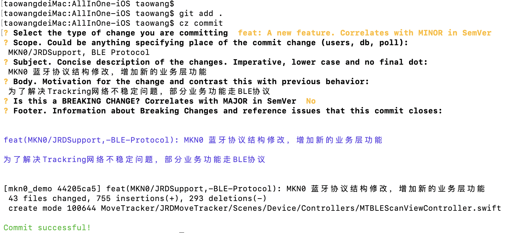
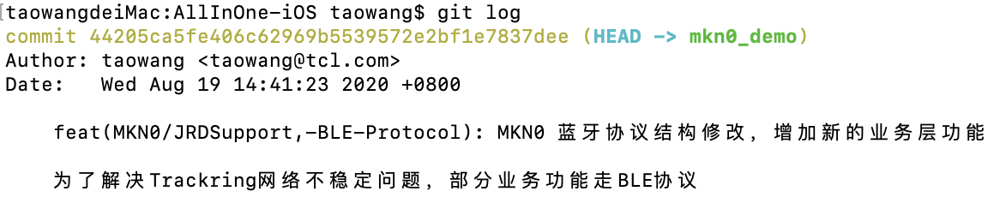

## Git 提交规范 

### 背景
<table><tr><td bgcolor=#F5F5F5>Git是现在市面上最流行的版本控制工具，书写良好的commit message 能大大提高代码维护效率。 但是在日常开发中由于 缺少对于commit message 的约束，导致填写内容随意、质量参差不齐，可读性低亦难以维护。在项目中引入commit message 规范已是迫在眉睫。</td></tr></table>

### 1. 用什么规范？

现在市面上比较流行的方案是约定式提交规范（Conventional Commits），它受到了Angular提交准则的启发，并在很大程度上以其为依据。约定式提交规范是一种基于提交消息的轻量级约定。它提供了一组用于创建清晰的提交历史的简单规则；这使得编写基于规范的自动化工具变得更容易。这个约定与SemVer相吻合，在提交信息中描述新特性、bug 修复和破坏性变更。它的 message 格式如下:

```
<type>(<scope>): <subject>
    //空行 （自动生成）
<body>
    //空行 （自动生成）
<footer>
```

除了第一行的Header部分必填外，其余均可选。注意Header, Body, Footer中间有空白行分割。

### 2. Commit message规范

#### 2.1 type

type为必填项，用于指定commit的类型，约定**feat**、**fix**两个主要type，以及**docs**、**style**、**build**、**refactor**、**revert**五个特殊type，其余type预留。 

```
# 主要type
feat:     增加新功能
fix:      修复bug

# 特殊type
docs:     只改动了文档相关的内容
style:    不影响代码含义的改动，例如去掉空格、改变缩进、增删分号
build:    构造工具的或者外部依赖的改动，例如webpack，npm
refactor: 代码重构时使用
revert:   执行git revert打印的message

# 预留type
test:     添加测试或者修改现有测试
perf:     提高性能的改动
ci:       与CI（持续集成服务）有关的改动
chore:    不修改src或者test的其余修改，例如构建过程或辅助工具的变动
```

#### 2.2 scope

scope也为选填项，建议填写。用于描述改动的范围，格式为项目名/模块名，例如：mt40/common mkn0/social，而sdk不需指定模块名。如果一次commit修改多个模块，可以采用分号隔开，不过建议拆分成多次commit，以便更好追踪和维护。

#### 2.3 subject

subject为必填项，用于概括描述该Commit的修改点。非常重要，必须简明扼要填写。

#### 2.4 body

body填写详细描述，主要描述改动之前的情况及修改动机，对于小的修改不作要求，但是重大需求、更新等必须添加body来作说明。

#### 2.5 break changes

break changes指明是否产生了破坏性修改，涉及break changes的改动必须指明该项，类似版本升级、接口参数减少、接口删除、迁移等。

#### 2.6 close issue

如果当前 commit 针对某个issue，那么可以在 Footer 部分关闭这个 issue 。
```
Closes #234
or
Closes #123, #234, #345
```

### 3. 示例

完整的commit message示例

<center></center>

git log 示例

<center></center>

### 4. 环境配置方法

#### 4.1 需求

Python 3.6+ 
Git 1.8.5.2+

#### 4.2 安装

```
sudo pip3 install -U Commitizen
```

#### 4.3 使用方法

在命令行模式下执行以下命令：

```
cd project  #进入项目git根目录
cz commit   #执行代码提交命令，替代git commit
```

具体请参考第3节 示例。