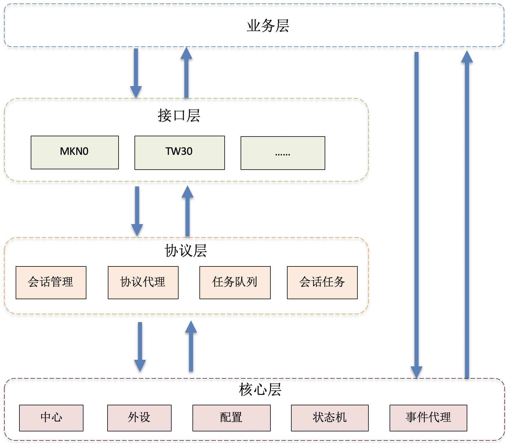
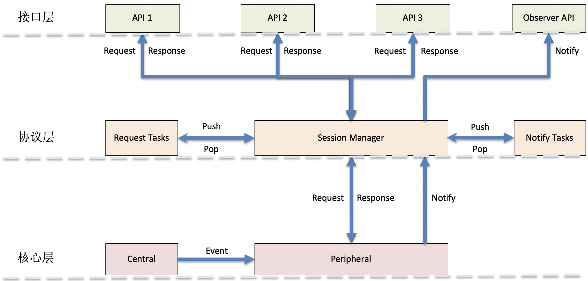

## 前言

目前iOS CoreBlueTooth相关的第三库已经有非常多，其中不乏非常优秀的封装库，如 [
BabyBluetooth](https://github.com/coolnameismy/BabyBluetooth) 和 [BluetoothKit](https://github.com/rhummelmose/BluetoothKit), 是 Objective-c 和 Swift 语言下最高Star的蓝牙封装框架。这两个库的共同优点是提供了非常简洁易用的API，高度抽象化蓝牙功能模块，框架中代码简洁、优雅。虽然有诸多优秀之处，但不便于我们直接拿来使用，原因如下：

- 冗余功能过多，我们只需要中心设备（蓝牙客户端），但是框架包含外围设备（服务端）。原架构设计兼顾了中心设备和外围设备，融入于整个层次化抽象内，导致了不适用于我们现有业务的冗余。

- 扩展性和业务调用方代码量的平衡问题，由于高扩展性，必然会带来业务代码量增加。如BabyBluetooth侧重于将CoreBluetooth离散的代理结构重构为功能和顺序更清晰的Block方式，API结构更清晰,也具备全量扩展能力,但是对于业务调用方仍需要实现所有的Block业务。这里需与业务复杂度达到一个平衡。
- 不便于扩展蓝牙协议通信，BLE通信的输入包括外设、服务、特征以及数据，除此之外还需要注意BLE连接状态，蓝牙权限等。而目前的框架侧重点在扫描，连接，发现服务和特征上，对于协议通信支持很弱或者没有支持。

针对于以上原因，我们需要一个功能复杂度适中、抽象层次恰当、通信协议扩展简洁的框架，这是设计TBluetooth的目的。

## 概述

该蓝牙框架主要包含两部分封装，分别是蓝牙核心层封装以及蓝牙通信协议封装。核心层提供了操作蓝牙必备的外部接口，事件监听以及代理回调，对非必须接口业务层无需关心，减少代码量。蓝牙通信协议封装提供了服务特征配置，协议代理，数据收发接口。对于业务层收发数据只需侧重关注数据本身，不需过多关注蓝牙操作层面的逻辑。

## 总体设计

TBluetooth 按照数据流方向分为三层，自顶而下为接口层、协议层和核心层，架构图如下：

<center></center>

整体结构图可以采用以下向导图表示：
 
<center></center>

业务模块API调用，模块内部工作流可以如下图所示：

<center></center>

架构说明：

- 接口层： 这层是针对于BLE业务协议抽象出来的，针对于不同的产品形态，可能定义了不同的BLE通信报文结构。这层定义了报文数据结构，组织方式，以及报文收发API。不同的业务方，可扩展不同是数据结构以及遵循协议接口约定的报文组织方式。

- 协议层： 这层主要包含两个部分，会话数据收发枢纽SessionManager和协议代理抽象类 StackProtocol。所有BLE报文都需要按照StackProtocol协议要求通过SessionManager进行收发。

- 核心层： BLE模块操作层，提供的外部API包括BLE扫描、发现服务、连接断开外设、BLE模块权限事件、服务特征配置器以及BLE中心设备状态机。

## 使用方法

```
/// 中心设备为单例
var central: TCBCentral {
    return TCBCentral.share
}

/// BLE 权限监听
central.addAvailabilityObserver(self)

/// 开始扫描外设 
central.scanWithDuration(0, filter: { (advertisementData, _) -> Bool in
    // filter表示扫描过滤器, true: 表示过滤  false: 表示不过滤
}, progressHandler: { [weak self] (discoveries) in
    // 当发现新外设时该回调会执行
}) { [weak self] (discoveries, error) in
    // 扫描结束时该回调执行
}

/// 开始连接外设
central.connect(remotePeripheral: peripheral) { remotePeripheral, error in

}

/// 外设连接成功之后，需要配置特征UUID，用于指定数据收发所用的特征值。
peripheral?.configure({ (configure) in
    configure.customCharacteristicUUID = "00005501-D102-11E1-9B23-00025B00A5A5"
})

/// 调用数据发送API
if peripheral?.isConnected {
    peripheral?.setData { (response, error) in
        if error == .none {
            print("Data has been sent and response has been called back")
        }
    }
}

/// 调用数据发送API，对于大数据发送，需要分包发送，API支持发送进度回调
if peripheral?.isConnected {
    peripheral?.sendData(processHandler: { (sent, total) in
        let percent = sent / total
        print("\(percent) of the data has been sent")                
    }) { (result, error) in
        
    }
}

/// 调用数据发送API, API支持中断数据发送
if peripheral?.isConnected {
    let task = peripheral?.setData { (response, error) in
        if error == .none {
            print("Data has been sent and response has been called back")
        }
    }
    task.interrupt()
}

///  BLE 权限事件监听
extension DiscoverViewController: TCBAvailabilityObserver {
    
    func availabilityObserver(_ availabilityObservable: TCBAvailabilityObservable, availabilityDidChange availability: TCBAvailability) {
        print("availabilityDidChange \(availability)")
        if availability == .available {
          scan()
        } else {
            central.interruptScan()
        }
    }
}
```


