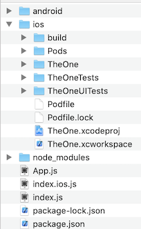
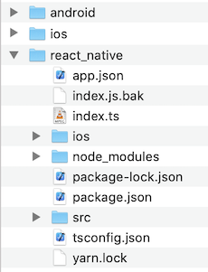
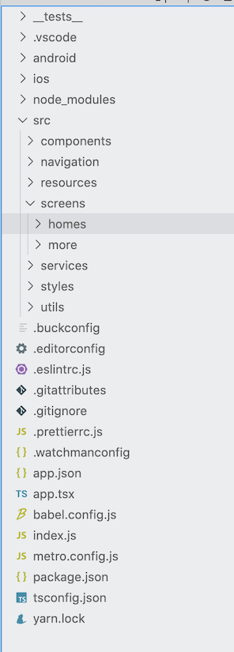

<h1 align="center">XXX Connect APP集成React Native实践</h1>

## 1. 为什么要集成React Native
&emsp;&emsp;虽然XXX Connect APP采用组件化技术后，可以支持全品类智能硬件接入, 但还是存在几个较为明显的缺陷。**主要表现在不具备动态支持新品类智能硬件接入，不具备跨平台协同共享模块能力**。这两个问题放在当下并不难解决，因为跨平台和热更新技术非常成熟，智能硬件类厂商采用这些技术也有非常优秀的商用产品，如米家APP，Hi-Link等。现在的关键问题点不是能不能解决这些缺陷，而是如何更好更优雅的解决。

&emsp;&emsp;目前主流的Hybrid技术有web, react native, weex, flutter。其中Web已在XXX Connect中采用，不做讨论。另外三个技术综合对比，也有较多优秀文章做了非常详细的对比，不展开讨论，本文侧重讨论技术与业务契合度。作为支持全品类的智能硬件管理类APP，需要支持几十上百款智能硬件，显然这些需求是迭代上升的，所以具备动态热更新能力是非常有必要，且几乎是不可或缺的能力。另外这类APP要与智能硬件以及服务端交互，Android & iOS端通信基础库和UI高度同质，所以具备协同共享模块能力也同样非常有必要。

&emsp;&emsp;综上，React Native似乎是最好的选择。React Native是非常优秀的跨平台，热更新框架, 应该是目前市面上Hybrid APP使用最广的技术。虽然React Native也存在很多缺陷，以至于大厂也有弃坑的，如Airbnb。但还是从业务角度出发，智能硬件类APP不涉及很复杂的UI绘制，不涉及很多系统层SDK能力支撑，所以综合考量，React Native仍然是最优解。

## 2. 认识React Native
从原生开发转战React Native，技术跨度较大，学习成本较高，所以清晰的学习路线尤为重要。我认为学习路线可以分为三个大的维度，基础 --> 实践 --> 模式。这三个维度是循循渐进的，一定要按照顺序学习，不然容易走弯路，掉入循环往复，学无止境的坑。下面展开来讨论：

### 2.1 基础
#### 2.1.1 语言基础
开发语言涉及Javascript, ES6, HTML/CSS，重点学习JS和ES。至于HTML/CSS大概过一遍，实战时再查阅，以下是推荐资源：

- [Javascript 高级教程 - W3school](https://www.w3school.com.cn/js/pro_js_syntax.asp)

- [ECMAScript 6 入门教程 - 阮一峰](https://es6.ruanyifeng.com/#README) 

- [HTML/CSS 序列教程 - W3school](https://www.w3school.com.cn/h.asp)

**注意:** 这部分大致花一两天时间快速通览，这个阶段达到能看懂React Native语法即可。

##### 2.1.2 React Native基础
需要熟悉React语言和React Native基础，以下是推荐学习资源：

- [React native 入门基础 - React native中文网](https://www.react-native.cn/docs/getting-started)

- [React 核心概念 - React 中文网](https://zh-hans.reactjs.org/docs/hello-world.html)

**注意：** 着重学习React Native的核心组件与原生组件，这是桥接Native和React知识非常好的桥梁，从中能发现React Native和原生的很多共性，便于平滑切入React Native知识。
着重学习React基础，特别是核心概念：components组件, JSX, props, state。其中props,state与原生开发的知识点有较大差异，需深入理解。

这个阶段需把握好知识面和速度，切记学习的内容在推荐的范围内，不要孤军深入，不然掉进前端的知识海洋里爬不起来。速度要较快完成，否则纯知识学习，没有结合实践，效率非常低下。

### 2.2 实践
##### 2.2.1 环境搭建
开发环境的搭建，参考[官方教程](https://www.react-native.cn/docs/environment-setup)即可。 关于开发工具，磨刀不误砍柴工，开发工具的选择至关重要。推荐使用VS Code，这是非常受JS开发者欢迎的IDE工具。VS Code兼容性和扩展性非常棒，有强大且丰富的插件资源，对于项目开发和debug效率提升有非常显著的效果。[VS Code React Native开发插件推荐](https://blog.csdn.net/qq_26585943/article/details/78987844)

##### 2.2.2开源项目
&emsp;&emsp;前端技术迭代非常快，比原生技术开发有过之而无不及。成熟的开源项目，其语法基础，第三方库，技术选型放在现在也许都已经被淘汰，或者已不推荐使用。但是架构思想，模块划分以及React Native的特性，依然是可以学习借鉴的，以下是一些开源项目

- [OneM - (redux)](https://www.jianshu.com/p/c8ce256db5cf)
- [react-pxq](https://github.com/bailicangdu/react-pxq)
- [react-native-easy-starter  (hooks)](https://github.com/HarishJangra/react-native-easy-starter)
- [react-cloud-music(redux + hooks) - 神三元](https://github.com/sanyuan0704/react-cloud-music) 

**注意：** 关于状态管理架构 Redux，Hooks, 先别急于深入学习，大致了解，能读懂代码即可。后续讨论 

### 2.3 模式
&emsp;&emsp;经过前面理论和实践的结合学习，应该具备了大部分项目的阅读能力，以及在特定设计模式下构建业务模块的能力。但是如何设计一个完整的项目架构，依然还有一个重点知识需要学习，那就是架构设计模式。关于React Native的设计模式，我认为这是原生开发工程师学习React Native知识的关键难点。以Redux为例，当原生开发工程师学习Redux时，难免会将其映射到MVC上。但是Redux与MVC在某种维度下是没有可比性的，MVC侧重架构模式上，而Redux侧重状态数据管理上。然后在另一种维度上，又存在一定的可比性。所以会形成一种似是而非的感觉。如果想进一步了解MVC与Redux的区别，可以参考[MVC,Flux和Redux的真正区别](https://blog.csdn.net/wangtao2536/article/details/117806530?spm=1001.2014.3001.5501)。

&emsp;&emsp;虽然Redux严格意义上不算是架构模式，但是作为状态管理模式基本贯穿整个软件业务实现。从数据维度看，前端软件无非就是数据管理、数据加工、数据展示，React Native中的状态管理模式基本涉及了这三个维度。所以构建项目架构，理解React Native的状态管理是非常有必要的。第三方状态管理库众多，主要有Redux、Mobx、Context、Recoil等，一些推荐学习资源如下：

- [Redux 入门教程 - 阮一峰](http://www.ruanyifeng.com/blog/2016/09/redux_tutorial_part_one_basic_usages.html?utm_source=tuicool&utm_medium=referral) 
- [Redux 通俗易懂文章 - 知乎](https://www.zhihu.com/question/41312576/answer/90782136)
- [MobX介绍 中文文档](https://cn.mobx.js.org)
- [Recoil 中文文档](https://recoil.js.cn)

&emsp;&emsp;为什么会出现如此众多的状态管理库，我认为根本原因是React 16.8以前，官方基本没有状态管理方案，但是强大的社区开发者群体，贡献出如此多状态管理方案。这是一把双刃剑，对于React老鸟非常有利，根据项目需要可以有更多选择。但是对于React小白非常不利，入门复杂度指数级上升啊。

针对现状问题，React官方在16.8新增了Hook特性，作为状态管理库，Hook相较于其他状态管理库更轻量，更易接入，对于入门开发者更友好。[React Hooks 官方文档](https://zh-hans.reactjs.org/docs/hooks-custom.html)
由于Hook是官方推出的库，对于原生开发者接受度更高。为什么呢？以iOS为例，MVC是Cocoa应用程序设计的核心，基础工程是基于MVC展开的，同理Android应用开发也是如此。在不基于第三方库的前提下，原生开发依然可以方便的构建软件框架，但是React Native比较难，必须得依赖第三状态管理库，否则难以构建软件架构。Hook的出现，打破了这个局面。

## 3. 如何集成React Native
XXX Connect APP如何集成React Native，可分为两大块，第一是React Native集成到原生应用，第二是React Native工程搭建。

### 3.1 React Native集成到原生应用：
React Native如何集成到原生项目，官方有详细的[指导教程](https://www.react-native.cn/docs/integration-with-existing-apps)：

**几点思考**

1. React Native版本更新比较频繁，教程是不会每次随版本更新而更新的，所以关键是几个命令和配置文件需要理解其意思，才能更好的应对集成产生的错误。所谓React Native坑常有，一个一个填便是。 关键的几个配置文件是package.json, podfile, manven。当React Native版本不同时，如果按照教程中的package.json, Podfile, manven配置，会存在问题。建议使用当前你安装的React Native版本，建一个纯React Native项目, 然后借鉴这些配置文件内容。

2. 按照官方教程生成的目录结构是这样的：

如果是纯React Native项目，我认为是非常合适的，但是对于Hybrid项目，这个目录结构是不合理的。特别是采用原生软件架构，部分业务模块采用React Native的项目，就更不合适了。所以我将目录结构做了一些调整，我认为比较理想的目录结构应该是这样的：

目录结构一定程度上反应了业务层次和架构层次，更便于理解，开发和维护。

**注意：** 调整目录结构时，文件夹名称不要有中文，空格等特殊字符，否则会产生一些[异常错误](https://github.com/facebook/react-native/issues/31259)

react-native目录下的ios,android目录，不仅是原生到React Native的入口，还是原生框架的组件入口。

3.git管理

android,ios,react-native三个目录对应三个git仓库。 采用git submodule统一管理，其中ios和android分别将React Native模块通过git submodule的方式依赖至源码中。这样设计的优势是，保持android,iOS原独立仓库不变，同时共享React Native仓库，保持一份React Native源码。

### 3.2 React Native工程搭建：
#### 3.2.1 技术选型
1. 开发语言选择Typescript, 相对于Javascript, TS更好的阅读性，静态类型检查，以及类型推导。更多TS与JS的区别，可以参考[Typesript vs Javascipt: The Key Differences You Should Know In 2021](https://flatlogic.com/blog/typescript-vs-javascript-the-key-differences-you-should-know-in-2020/#two)

2. 状态管理库选择Hook，不采用Redux，更不采用Redux+Hook的方式。 具体原因在2.3节有阐述。

3. 尽可能少的依赖第三方库，引入的价值也许不如麻烦多。

#### 3.2.2 工程目录结构

**/src/index.ts:**
默认React Native程序入口

**components:**
存放基础共享组件，或是与业务无关的自定义UI组件

**navigation:**
路由导航模块

**resources:**
资源文件，包括图像和多语言字符串

**screens:**
所有的业务模块都存放在该目录下，业务按模块划分

**services:**
网络服务层，网络基础库封装，业务方网络请求API

**styles:**
全局样式模块，包括字体，颜色，样式等。

**utils:**
工具类模块，提供helper类方法，注意与业务模块的无关性。

